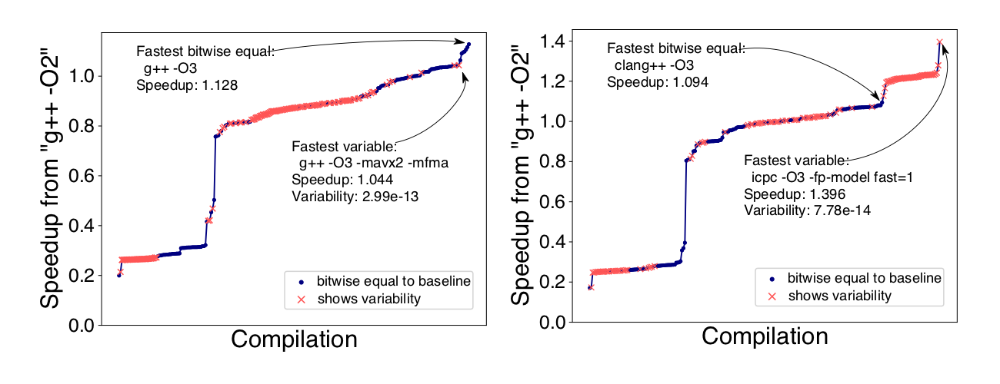
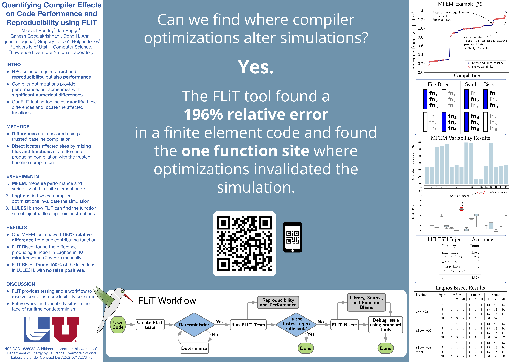

+++
date = "2017-01-27T22:16:37-07:00"
title = "FLiT"
parent = "toolset"
+++

<h1>FLiT</h1>

---

## Description

#### FLiT Workfow overview, more detail on the bisection step is in [our paper](https://doi.org/10.1145/3307681.3325960)

FLiT (originally named Floating-point Litmus Tester, but is more than that now) is a test infrastructure for detecting and locating varibility in floating-point code caused by variations in compiler code generation, hardware and execution environments. Tests can range from unit tests of functions, to full executbles.

FLiT works by building many versions of the test suite, using multiple C++ compilers, floating-point related settings (i.e. flags) and optimization levels. These tests are then executed and compared against a user-specified trusted baseline compilation.  The comparison 'score' is collected into a database, along with the other parameters relevant to the execution, such as host, compiler configuration and compiler vendor.

After executing the suite and collecting the data, it is easy to see how results may diverge using only different compiler settings, etc. Also, the developer is able to understand how to configure their build environment for their target architecture(s) such that they can expect consistent floating-point computations.  Also, with timing measurements, users can weigh the trade-offs of variability and performance of each of the compiler optimizations.

#### MFEM examples, speedup vs. compilation with compilations sorted by speedup. Both bitwise equal and variable compilations are shown. In (a), the fastest bitwise equal compilation was the fastest overall. In (b), the opposite is true.

Once the value-changing optimizations are found, FLiT bisect is able to determine
what source file was optimized that induced the value change, and is often able norrow this down to the function level.

It consists of the following components:

* a c++ test infrastructure
* a dynamic make system to generate diverse executables
* a SQL database for collecting results
* a bisection tool which can determine where in code the optimizations changed your results

Most recent publication describing the new functionality:
[HPDC'19](https://doi.org/10.1145/3307681.3325960),
[arXiv](https://arxiv.org/abs/1811.05618)

[HPDC'19 Poster](../img/2019-06-hpdc-flit-poster.pdf)

---

### Software

FLiT is an open-source tool and can be obtained on <a class="smooth-link" title="GitHub" href="https://github.com/PRUNERS/FLiT" target="_blank"><u>GitHub</u> <i class="fa fa-github"></i></a>.